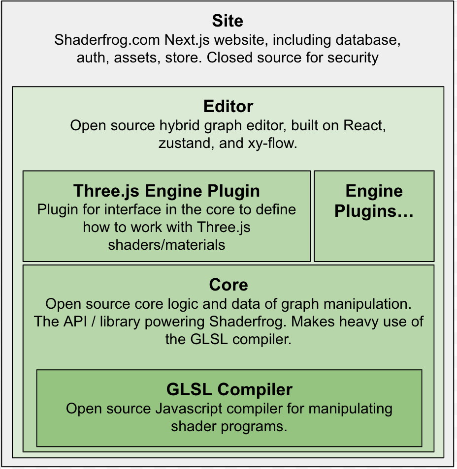

# Shaderfrog 2.0 "Hybrid Graph" UI Editor


This is the standalone repository for the Shaderfrog Hybrid Graph Editor UI. For
convenience of local development, this repository is also configured as a
Next.js app, so you can run the Next.js server locally to develop on the editor
component.

## Install and run

Install:
```bash
npm install
```

Then start the Next.js app:

```bash
npm run dev
```

Navigate to [http://localhost:3000](http://localhost:3000).

## Local development

Shaderfrog is built on a nested tech stack, sometimes called "open core" software.



The code struture:
```bash
src/ # All source code
  editor/                # The editor component code
  editor-engine-plugins/ # The engine specific UI components (like Babylon, Three)
  editor-util/           # Shared utility functions
  shaders/               # Example shaders
  pages/                 # The Next.js app page
  api/                   # API interface and stub API data
```

In production, the Shaderfrog editor reads from a database and lets you create
and save shaders. This standalone editor does not let you persist shaders.

Instead, there is a stub API implementation for both server-side rendered props
and client API calls in `src/api/stub.ts`.
